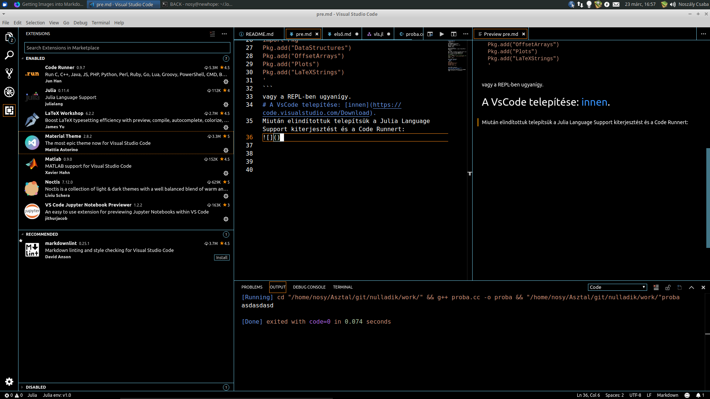

# Julia telepítése
A következőket az:
```bash
$ lsb_release -a
No LSB modules are available.
Distributor ID:	Ubuntu
Description:	Ubuntu 18.04.2 LTS
Release:	18.04
Codename:	bionic
```
os-en teszteltem<br>
Nyissunk egy terminált és mezei felhasználóként adjuk ki a:
```bash
cd ~/.local
wget https://julialang-s3.julialang.org/bin/linux/x64/1.1/julia-1.1.0-linux-x86_64.tar.gz
tar xzf julia-1.1.0-linux-x86_64.tar.gz
ln -s julia-1.1.0 julia # így könnyen váltogathatjuk
echo >> ~/.bashrc # ha nincs sorvége a fájl végén
echo 'export PATH=~/.local/julia/bin:$PATH' >> ~/.bashrc
source ~/.bashrc
```
parancsokat (copy-paste).
# Csomagok telepítése:
```bash
julia <<< '
import Pkg
Pkg.add("DataStructures")
Pkg.add("OffsetArrays")
Pkg.add("Plots")
Pkg.add("LaTeXStrings")
'
```
vagy a REPL-ben ugyanígy.
# A VsCode telepítése: [innen](https://code.visualstudio.com/Download).
Miután elindítottuk telepítsük a Julia Language Support kiterjesztést és a Code Runnert:



